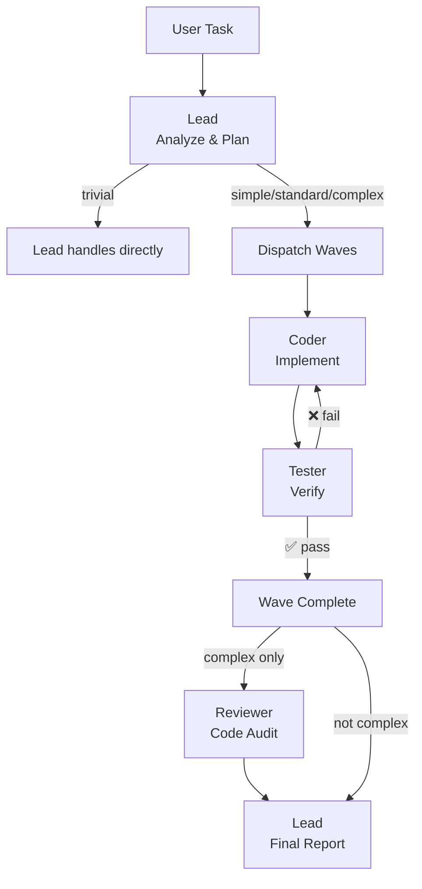

# Emperor — OpenCode Multi-Agent Collaboration Plugins

Two [OpenCode](https://opencode.ai) plugins for multi-agent collaboration in software development.

| Plugin | Agents | Philosophy | Best For |
|--------|--------|------------|----------|
| **Emperor** (三省六部) | 11 | Governance — checks & balances | Tasks needing rigorous review |
| **Commander** | 4 | Engineering — fast iteration | Most development tasks |

---

## Commander Plugin

A lightweight, adaptive multi-agent plugin with 4 agents and a single orchestrator pattern. Optimized for speed and tight feedback loops.

### Architecture



### Four Agents

| Agent | Role | Responsibility |
|-------|------|----------------|
| **Lead** | Orchestrator | Explores codebase, creates plans, classifies complexity, summarizes results |
| **Coder** | Implementer | Writes code based on subtask specs from Lead |
| **Tester** | Verifier | Runs tests, build verification; triggers fix loop on failure |
| **Reviewer** | Auditor | Code review for complex tasks only (security, architecture, quality) |

### Adaptive Complexity

Lead classifies each task automatically:

| Complexity | Condition | Flow |
|------------|-----------|------|
| **trivial** | No subtasks | Lead handles directly |
| **simple** | 1 low-effort subtask | Coder → Tester |
| **standard** | Multiple subtasks | Parallel waves of Coder → Tester |
| **complex** | High-effort or risky | Parallel waves + Reviewer audit |

### Coder↔Tester Fix Loop

The core quality mechanism. When Tester fails verification:

1. Coder gets failure context (same session — context accumulates)
2. Coder fixes → Tester re-verifies (same session)
3. Repeat up to `maxFixLoops` (default: 3)
4. If still failing → mark subtask as failed

### Tools

| Tool | Description |
|------|-------------|
| `cmd_task` | Create a task for the Commander team |
| `cmd_status` | View task status and history |
| `cmd_halt` | Emergency stop an active task |

### Configuration

Create `.opencode/commander.json` (optional — all settings have defaults):

```json
{
  "agents": {
    "lead": { "model": "anthropic/claude-sonnet-4-20250514" },
    "coder": { "model": "anthropic/claude-sonnet-4-20250514" },
    "tester": { "model": "anthropic/claude-sonnet-4-20250514" },
    "reviewer": { "model": "anthropic/claude-sonnet-4-20250514" }
  },
  "pipeline": {
    "maxFixLoops": 3,
    "enableReviewer": true,
    "sensitivePatterns": ["删除|remove|delete", "production|deploy", "密钥|secret|credential"]
  },
  "store": {
    "dataDir": ".commander"
  }
}
```

### Usage

Switch to the `lead` agent in OpenCode:

```
@lead Add user authentication with JWT tokens, refresh mechanism, and role-based access control
```

Or use the task tool from any agent:

```
Use cmd_task tool:
  title: "User Authentication"
  content: "Implement JWT auth, token refresh, RBAC"
  priority: "high"
```

---

## Emperor Plugin (三省六部)

Maps ancient China's Three Departments and Six Ministries governance system into a multi-agent architecture. 11 agents with checks and balances for rigorous task execution.

### Architecture



```mermaid
graph TD
    User["User's Edict"] --> Taizi["Crown Prince<br/>Task Triage"]
    Taizi --> Jinyiwei["Jinyiwei<br/>Project Reconnaissance"]
    Jinyiwei --> Zhongshu["Zhongshu Province<br/>Planning"]
    Zhongshu --> Menxia["Menxia Province<br/>Review & Veto"]
    Menxia -->|Reject| Zhongshu
    Menxia -->|Approve| Shangshu["Shangshu Province<br/>Execution Dispatch"]
    Shangshu --> Libu["Libu<br/>Architecture"]
    Shangshu --> Hubu["Hubu<br/>Testing"]
    Shangshu --> Libu2["Libu2<br/>API Docs"]
    Shangshu --> Bingbu["Bingbu<br/>Security Testing"]
    Shangshu --> Xingbu["Xingbu<br/>Security Audit"]
    Shangshu --> Gongbu["Gongbu<br/>Infrastructure"]
    Libu --> Memorial["Memorial Summary"]
    Hubu --> Memorial
    Libu2 --> Memorial
    Bingbu --> Memorial
    Xingbu --> Memorial
    Gongbu --> Memorial
    Memorial --> Taizi
```

### Eleven Agents

| Agent | Role | Responsibility |
|-------|------|----------------|
| **Crown Prince** (taizi) | Triage | Receives requests, communicates only with Three Provinces |
| **Jinyiwei** (jinyiwei) | Reconnaissance | Scans project code, generates architecture reports |
| **Zhongshu Province** (zhongshu) | Planner | Breaks down tasks, outputs structured JSON plans |
| **Menxia Province** (menxia) | Reviewer | Reviews plans, can veto and send back |
| **Shangshu Province** (shangshu) | Dispatcher | Parallel execution dispatch, progress monitoring |
| **Libu** (libu) | Architect | Code architecture, refactoring, type systems |
| **Hubu** (hubu) | Tester | Testing and verification (mandatory) |
| **Libu2** (libu2) | API Officer | API design, documentation |
| **Bingbu** (bingbu) | Security Officer | Security testing, performance |
| **Xingbu** (xingbu) | Auditor | Security audit, compliance (read-only) |
| **Gongbu** (gongbu) | Engineer | Build tools, CI/CD, infrastructure |

### Tools

| Tool | Description |
|------|-------------|
| `emperor_create_edict` | Create an edict and start the workflow |
| `emperor_view_memorial` | View execution history and results |
| `emperor_halt_edict` | Emergency halt an active edict |

### Configuration

See `.opencode/emperor.json` for configuration options. Key settings:

- **reviewMode**: `auto` / `manual` / `mixed` (recommended)
- **sensitivePatterns**: Keywords triggering manual review
- **mandatoryDepartments**: Departments required in every plan (default: `["hubu"]`)
- **maxPlanningRetries**: Max retries when Menxia rejects a plan

### Usage

```
@taizi Add user authentication with JWT tokens and role-based access control
```

### Built-in Skills

| Skill | Description |
|-------|-------------|
| `taizi-reloaded` | Enhanced Crown Prince with judgment-execution separation |
| `quick-verify` | Forced pre-delivery verification |
| `hubu-tester` | Complete verification report template |
| `menxia-reviewer` | Code security review |

---

## Installation

### Plugin Registration

Add plugin paths in `.opencode/opencode.json`:

```json
{
  "$schema": "https://opencode.ai/config.json",
  "plugin": [
    "./plugins/emperor/index.ts",
    "./plugins/commander/index.ts"
  ]
}
```

You can enable one or both plugins.

## Project Structure

```
.opencode/
├── opencode.json                        # Plugin registration
├── emperor.json                         # Emperor config (optional)
├── commander.json                       # Commander config (optional)
└── plugins/
    ├── emperor/                         # Emperor plugin (11 agents)
    │   ├── index.ts
    │   ├── types.ts
    │   ├── config.ts
    │   ├── store.ts
    │   ├── agents/prompts.ts
    │   ├── skills/
    │   ├── engine/
    │   │   ├── pipeline.ts
    │   │   ├── recon.ts
    │   │   ├── reviewer.ts
    │   │   └── dispatcher.ts
    │   └── tools/
    │       ├── edict.ts
    │       ├── memorial.ts
    │       └── halt.ts
    └── commander/                       # Commander plugin (4 agents)
        ├── index.ts
        ├── types.ts
        ├── config.ts
        ├── store.ts
        ├── agents/
        │   ├── lead.ts
        │   ├── coder.ts
        │   ├── tester.ts
        │   └── reviewer.ts
        ├── engine/
        │   ├── pipeline.ts
        │   ├── classifier.ts
        │   └── dispatcher.ts
        └── tools/
            ├── task.ts
            ├── status.ts
            └── halt.ts
```

## Tech Stack

- **Runtime**: Bun
- **Language**: TypeScript (strict mode)
- **Plugin SDK**: @opencode-ai/plugin
- **Data Persistence**: JSON file storage

## Publishing

Each plugin is published independently to npm:

```bash
# Emperor release
git tag emperor-v0.5.1 && git push --tags

# Commander release
git tag commander-v0.1.0 && git push --tags
```

Tag pattern triggers CI to build and publish only the corresponding package.

| Package | npm |
|---------|-----|
| `opencode-plugin-emperor` | Emperor plugin |
| `opencode-plugin-commander` | Commander plugin |

---

[中文版](./README.zh-CN.md) | [English](./README.md)
