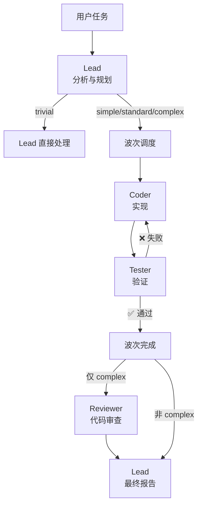
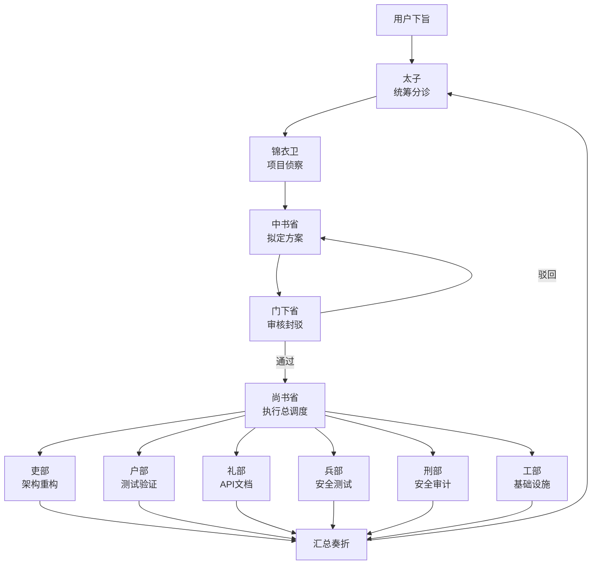

# Emperor — OpenCode 多智能体协作插件

两个 [OpenCode](https://opencode.ai) 多智能体协作插件，用于软件开发。

| 插件 | Agent 数 | 理念 | 适用场景 |
|------|---------|------|---------|
| **Emperor**（三省六部） | 11 | 治理型 — 制衡审核 | 需要严格审查的任务 |
| **Commander** | 4 | 工程型 — 快速迭代 | 大多数开发任务 |

---

## Commander 插件

轻量级自适应多智能体插件，4 个 Agent 配合单指挥官模式。针对速度和紧密反馈循环优化。

### 架构



### 四个 Agent

| Agent | 角色 | 职责 |
|-------|------|------|
| **Lead** | 指挥官 | 探索代码库、制定计划、分类复杂度、汇总结果 |
| **Coder** | 实现者 | 根据 Lead 的子任务规格编写代码 |
| **Tester** | 验证者 | 运行测试、构建验证；失败时触发修复循环 |
| **Reviewer** | 审查者 | 仅对复杂任务进行代码审查（安全、架构、质量） |

### 自适应复杂度

Lead 自动分类每个任务：

| 复杂度 | 条件 | 流程 |
|--------|------|------|
| **trivial** | 无子任务 | Lead 直接处理 |
| **simple** | 1 个低工作量子任务 | Coder → Tester |
| **standard** | 多个子任务 | 并行波次 Coder → Tester |
| **complex** | 高工作量或有风险 | 并行波次 + Reviewer 审查 |

### Coder↔Tester 修复循环

核心质量机制。当 Tester 验证失败时：

1. Coder 获取失败上下文（同一 session，上下文持续积累）
2. Coder 修复 → Tester 重新验证（同一 session）
3. 最多重复 `maxFixLoops` 次（默认 3 次）
4. 仍然失败 → 标记子任务失败

### 工具

| 工具 | 说明 |
|------|------|
| `cmd_task` | 创建任务交由 Commander 团队执行 |
| `cmd_status` | 查看任务状态和历史记录 |
| `cmd_halt` | 紧急叫停正在执行的任务 |

### 配置

创建 `.opencode/commander.json`（可选，所有设置都有默认值）：

```json
{
  "agents": {
    "lead": { "model": "anthropic/claude-sonnet-4-20250514" },
    "coder": { "model": "anthropic/claude-sonnet-4-20250514" },
    "tester": { "model": "anthropic/claude-sonnet-4-20250514" },
    "reviewer": { "model": "anthropic/claude-sonnet-4-20250514" }
  },
  "pipeline": {
    "maxFixLoops": 3,
    "enableReviewer": true,
    "sensitivePatterns": ["删除|remove|delete", "production|deploy", "密钥|secret|credential"]
  },
  "store": {
    "dataDir": ".commander"
  }
}
```

### 使用方式

在 OpenCode 中切换到 `lead` Agent：

```
@lead 给项目添加用户认证系统，包括 JWT token、刷新机制和角色权限控制
```

或者从任何 Agent 调用任务工具：

```
使用 cmd_task 工具:
  title: "用户认证系统"
  content: "实现 JWT 认证、token 刷新、RBAC 权限控制"
  priority: "high"
```

---

## Emperor 插件（三省六部）

将中国古代三省六部制的治理智慧映射为多智能体协作架构。11 个 Agent，制衡审核，严格把关任务执行。

### 架构



### 十一部 Agent

| Agent | 角色 | 职责 |
|-------|------|------|
| **太子** (taizi) | 分诊官 | 接收请求，只与三省沟通 |
| **锦衣卫** (jinyiwei) | 侦察官 | 扫描项目代码，生成架构报告 |
| **中书省** (zhongshu) | 规划师 | 拆解任务，输出结构化 JSON 方案 |
| **门下省** (menxia) | 审查官 | 审核方案，可封驳退回 |
| **尚书省** (shangshu) | 调度官 | 并行调度执行，监控进度 |
| **吏部** (libu) | 架构师 | 代码架构、重构、类型系统 |
| **户部** (hubu) | 测试官 | 测试验证（强制参与） |
| **礼部** (libu2) | 接口官 | API 设计、文档 |
| **兵部** (bingbu) | 安全官 | 安全测试、性能 |
| **刑部** (xingbu) | 审计官 | 安全审计、合规检查（只读） |
| **工部** (gongbu) | 工程师 | 构建工具、CI/CD、基础设施 |

### 工具

| 工具 | 说明 |
|------|------|
| `emperor_create_edict` | 下旨，启动完整流转 |
| `emperor_view_memorial` | 查看执行历史和结果 |
| `emperor_halt_edict` | 紧急叫停 |

### 配置

详见 `.opencode/emperor.json`。关键配置：

- **reviewMode**: `auto` / `manual` / `mixed`（推荐）
- **sensitivePatterns**: 触发人工审核的关键词
- **mandatoryDepartments**: 强制参与的部门（默认 `["hubu"]`）
- **maxPlanningRetries**: 门下省驳回后的最大重试次数

### 使用方式

```
@taizi 给项目添加用户认证系统，包括 JWT token、刷新机制和角色权限控制
```

### 内置 Skills

| Skill | 说明 |
|-------|------|
| `taizi-reloaded` | 太子增强版，判断-执行分离 |
| `quick-verify` | 快速验证技能，强制交付前验证 |
| `hubu-tester` | 户部测试官，完善的验证报告模板 |
| `menxia-reviewer` | 门下省审核官，代码安全审查 |

---

## 安装

### 插件注册

在 `.opencode/opencode.json` 中添加插件路径：

```json
{
  "$schema": "https://opencode.ai/config.json",
  "plugin": [
    "./plugins/emperor/index.ts",
    "./plugins/commander/index.ts"
  ]
}
```

可以启用一个或两个插件。

## 项目结构

```
.opencode/
├── opencode.json                        # 插件注册
├── emperor.json                         # Emperor 配置（可选）
├── commander.json                       # Commander 配置（可选）
└── plugins/
    ├── emperor/                         # Emperor 插件（11 agents）
    │   ├── index.ts
    │   ├── types.ts
    │   ├── config.ts
    │   ├── store.ts
    │   ├── agents/prompts.ts
    │   ├── skills/
    │   ├── engine/
    │   │   ├── pipeline.ts
    │   │   ├── recon.ts
    │   │   ├── reviewer.ts
    │   │   └── dispatcher.ts
    │   └── tools/
    │       ├── edict.ts
    │       ├── memorial.ts
    │       └── halt.ts
    └── commander/                       # Commander 插件（4 agents）
        ├── index.ts
        ├── types.ts
        ├── config.ts
        ├── store.ts
        ├── agents/
        │   ├── lead.ts
        │   ├── coder.ts
        │   ├── tester.ts
        │   └── reviewer.ts
        ├── engine/
        │   ├── pipeline.ts
        │   ├── classifier.ts
        │   └── dispatcher.ts
        └── tools/
            ├── task.ts
            ├── status.ts
            └── halt.ts
```

## 技术栈

- **运行时**: Bun
- **语言**: TypeScript (strict mode)
- **插件 SDK**: @opencode-ai/plugin
- **数据持久化**: JSON 文件存储

## 发布

每个插件独立发布到 npm：

```bash
# Emperor 发布
git tag emperor-v0.5.1 && git push --tags

# Commander 发布
git tag commander-v0.1.0 && git push --tags
```

Tag 模式触发 CI 自动构建并发布对应的包。

| 包名 | 说明 |
|------|------|
| `opencode-plugin-emperor` | Emperor 插件 |
| `opencode-plugin-commander` | Commander 插件 |

---

[English](./README.md) | [中文版](./README.zh-CN.md)
