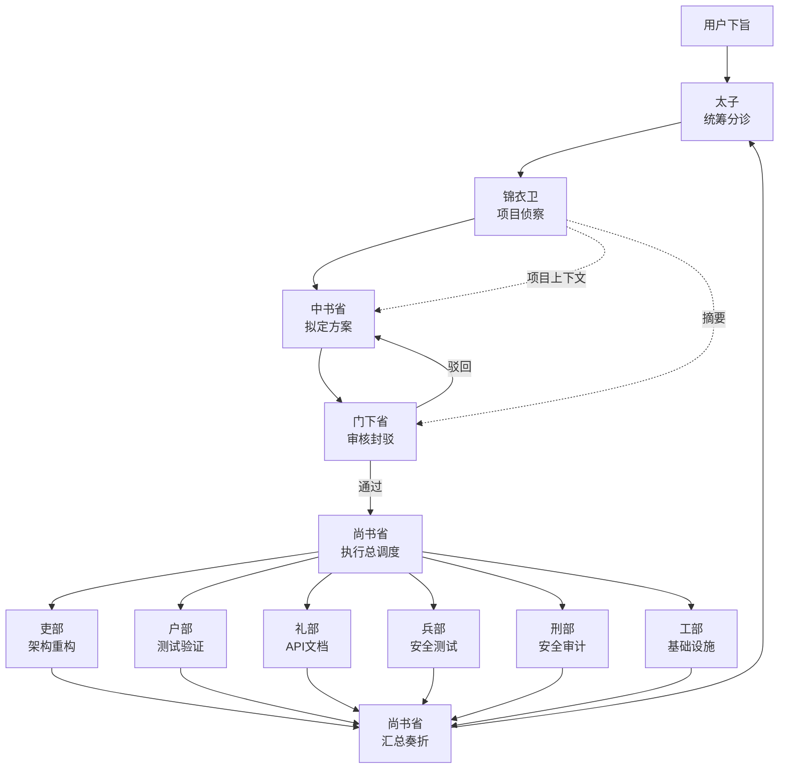

# Emperor — 三省六部多智能体协作系统

一个 [OpenCode](https://opencode.ai) 插件，将中国古代三省六部制的治理智慧映射为多智能体协作架构，用于编排复杂的编程任务。

## 架构概览



**完整流程**：用户下旨 → 太子分诊 → 锦衣卫侦察 → 中书省规划 → 门下省审核 → 尚书省调度 → 六部并行执行 → 尚书省汇总奏折 → 太子验收

**核心规则**：太子只与三省（中书省、门下省、尚书省）沟通，绝不直接找六部派活。

## 十一部 Agent

| Agent | 角色 | 职责 |
|-------|------|------|
| **太子** (taizi) | 分诊官 | 接收用户请求，分析任务性质，只与三省沟通 |
| **锦衣卫** (jinyiwei) | 侦察官 | 扫描项目代码，生成架构图和上下文报告，为规划提供情报 |
| **中书省** (zhongshu) | 规划师 | 将任务拆解为子任务，分配给对应六部，输出结构化 JSON 方案 |
| **门下省** (menxia) | 审查官 | 审核中书省方案的合理性、风险和依赖关系，可封驳退回 |
| **尚书省** (shangshu) | 执行总调度 | 接收审核通过的方案，调度六部并行执行，监控进度，汇总奏折 |
| **吏部** (libu) | 架构师 | 负责代码架构、重构、类型系统、模块设计 |
| **户部** (hubu) | 测试官 | 负责测试与验证，确保代码能正常工作（强制参与） |
| **礼部** (libu2) | 接口官 | 负责 API 设计、协议对接、文档编写 |
| **兵部** (bingbu) | 安全官 | 负责安全测试、性能优化、错误处理 |
| **刑部** (xingbu) | 审计官 | 负责安全审计、合规检查、漏洞扫描（只读，不修改代码） |
| **工部** (gongbu) | 工程师 | 负责构建工具、CI/CD、部署、环境配置 |

## 自定义工具

### 下旨 (`emperor_create_edict`)

创建圣旨并启动完整流转流程。

```
输入参数:
  - title: 圣旨标题
  - content: 具体需求描述
  - priority: 优先级 (low / medium / high / critical)
```

### 查看奏折 (`emperor_view_memorial`)

查询历史圣旨和执行结果。

```
输入参数:
  - edict_id: (可选) 查看特定圣旨的奏折
  - status: (可选) 按状态筛选 (planning / reviewing / executing / completed / failed / halted)
```

### 叫停 (`emperor_halt_edict`)

紧急叫停正在执行的圣旨。

```
输入参数:
  - edict_id: 要叫停的圣旨 ID
  - reason: 叫停原因
```

## 安装配置

### 1. 插件注册

在 `.opencode/opencode.json` 中添加插件路径：

```json
{
  "$schema": "https://opencode.ai/config.json",
  "plugin": [
    "./plugins/emperor/index.ts"
  ]
}
```

### 2. Emperor 配置

插件使用独立的 `.opencode/emperor.json` 配置文件（不与 `opencode.json` 混合）：

```json
{
  "agents": {
    "taizi": { "model": "anthropic/claude-sonnet-4-20250514" },
    "jinyiwei": { "model": "anthropic/claude-sonnet-4-20250514" },
    "zhongshu": { "model": "anthropic/claude-sonnet-4-20250514" },
    "menxia": { "model": "anthropic/claude-sonnet-4-20250514" },
    "shangshu": { "model": "anthropic/claude-sonnet-4-20250514" },
    "libu": { "model": "anthropic/claude-sonnet-4-20250514" },
    "hubu": { "model": "anthropic/claude-sonnet-4-20250514" },
    "libu2": { "model": "anthropic/claude-sonnet-4-20250514" },
    "bingbu": { "model": "anthropic/claude-sonnet-4-20250514" },
    "xingbu": { "model": "anthropic/claude-sonnet-4-20250514" },
    "gongbu": { "model": "anthropic/claude-sonnet-4-20250514" }
  },
  "pipeline": {
    "maxPlanningRetries": 3,
    "reviewMode": "mixed",
    "sensitivePatterns": ["删除", "drop", "rm -rf", "production", "密钥", "credentials"],
    "mandatoryDepartments": ["hubu"],
    "requirePostVerification": true
  },
  "recon": {
    "enabled": true,
    "cacheDir": "recon"
  },
  "store": {
    "dataDir": ".opencode/emperor-data"
  }
}
```

#### 配置项说明

- **agents**: 每个 Agent 的模型配置，可按需指定不同模型
- **pipeline.maxPlanningRetries**: 中书省规划被门下省驳回后的最大重试次数
- **pipeline.reviewMode**: 审核模式
  - `auto` — 自动审核，敏感操作仍需人工确认
  - `manual` — 所有操作都需人工确认
  - `mixed` — 默认自动，检测到敏感操作时转为人工（推荐）
- **pipeline.sensitivePatterns**: 触发人工审核的关键词列表
- **pipeline.mandatoryDepartments**: 强制参与的部门列表（默认 `["hubu"]`），中书省方案中必须包含这些部门，否则门下省将自动驳回
- **pipeline.requirePostVerification**: 是否在六部执行完成后进行户部后置验证（默认 `true`）
- **store.dataDir**: 圣旨数据持久化目录
- **recon.enabled**: 是否启用锦衣卫侦察（默认 `true`）。禁用后跳过 Phase 0，不注入项目上下文
- **recon.cacheDir**: 侦察报告缓存目录（相对于 store.dataDir），按 git hash 缓存，同一提交不重复扫描

## 使用方式

### 方式一：通过太子 Agent

在 OpenCode 中切换到 `taizi` Agent，直接描述你的需求：

```
@taizi 我需要给项目添加用户认证系统，包括 JWT token、刷新机制、以及角色权限控制
```

太子会自动分诊并触发完整的三省六部流转。

### 方式二：通过下旨工具

任何 Agent 都可以调用下旨工具：

```
使用 emperor_create_edict 工具:
  title: "用户认证系统"
  content: "实现 JWT 认证、token 刷新、RBAC 权限控制"
  priority: "high"
```

### 查看执行结果

```
使用 emperor_view_memorial 工具:
  edict_id: "edict_1709712000000_a1b2"
```

## 流转机制

### 敏感操作检测

门下省会自动扫描子任务描述，匹配敏感关键词（如"删除"、"production"、"密钥"等）。匹配到时：

1. 标记为敏感操作
2. 弹出确认对话框，需用户手动批准
3. 用户可选择批准或驳回

### 锦衣卫侦察（Phase 0）

每次下旨执行前，锦衣卫会先扫描项目代码，生成包含 mermaid 图表的结构化报告：

1. **技术栈识别**：语言、框架、构建工具、包管理器
2. **目录结构分析**：模块划分、入口文件、配置位置
3. **架构模式识别**：设计模式、分层架构、数据流
4. **依赖关系图**：mermaid 模块依赖图
5. **功能地图**：与旨意相关的功能模块详细分析

**分层注入**（控制 token 成本）：
- 完整报告 → 中书省（规划需要全貌了解）
- 摘要报告 → 门下省（审核只需关键信息）
- 不注入 → 尚书省、六部（避免 token 浪费）

**智能缓存**：结果按 git hash 缓存，同一提交不重复扫描，大幅降低成本。

### 强制部门参与

通过 `mandatoryDepartments` 配置，可强制要求特定部门参与每次任务执行。默认要求户部（测试验证）参与，确保所有方案都经过测试。该检查在门下省审核阶段和代码层面同时执行，缺少必要部门的方案将被自动驳回。

### 依赖调度

六部子任务支持依赖声明。调度引擎使用拓扑排序（Kahn 算法）将子任务分组为执行波次：

- **Wave 1**: 无依赖的子任务并行执行
- **Wave 2**: 依赖 Wave 1 结果的子任务并行执行
- **依此类推...**

### 尚书省调度

尚书省作为执行总调度，在门下省审核通过后接管流程：

1. **预调度**：审查执行策略，确认资源分配
2. **代码调度**：基于拓扑排序并行调度六部执行
3. **后置验证**：可选的户部后置验证环节
4. **汇总奏折**：AI 生成结构化奏折，汇报各部执行结果

### 奏折格式

执行完成后，尚书省生成结构化奏折（Memorial），包含：

- 各部执行结果和状态
- 成功/失败统计
- 风险提示和门下省审核意见

## 项目结构

```
.opencode/
├── emperor.json                         # 插件配置
├── opencode.json                        # OpenCode 配置（注册插件）
└── plugins/emperor/
    ├── index.ts                         # 插件入口
    ├── types.ts                         # 类型定义
    ├── config.ts                        # 配置加载器
    ├── store.ts                         # 圣旨数据持久化
    ├── agents/
    │   └── prompts.ts                   # 十一部 Agent 系统提示词
    ├── skills/                          # 插件内置 Skills
    │   ├── taizi-reloaded/              # 太子增强版（判断-执行分离）
    │   ├── quick-verify/                # 快速验证技能
    │   ├── hubu-tester/                 # 户部测试官
    │   └── menxia-reviewer/             # 门下省审核官
    ├── engine/
    │   ├── pipeline.ts                  # 流转引擎主流程（含锦衣卫侦察 + 尚书省调度）
    │   ├── recon.ts                     # 锦衣卫侦察引擎（git-hash 缓存 + 分层注入）
    │   ├── reviewer.ts                  # 门下省审核 + 强制部门检查 + 敏感操作检测
    │   └── dispatcher.ts               # 六部调度（拓扑排序 + 并行执行）
    └── tools/
        ├── edict.ts                     # 下旨工具
        ├── memorial.ts                  # 查看奏折工具
        └── halt.ts                      # 叫停工具
```

## 内置 Skills

插件自带以下增强版 Skills，安装插件后自动启用：

| Skill | 说明 |
|-------|------|
| `taizi-reloaded` | 太子增强版，强调判断-执行分离和验证优先 |
| `quick-verify` | 快速验证技能，强制交付前验证 |
| `hubu-tester` | 户部测试官，完善的验证报告模板 |
| `menxia-reviewer` | 门下省审核官，增加代码安全审查 |

### 使用方式

```
@skill taizi-reloaded
@skill quick-verify
@skill hubu-tester
@skill menxia-reviewer
```

## 技术栈

- **运行时**: Bun
- **语言**: TypeScript (strict mode)
- **插件 SDK**: @opencode-ai/plugin
- **数据持久化**: JSON 文件存储
